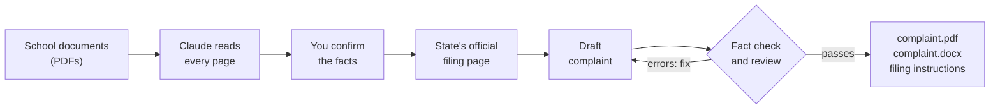

# Due Process Complaint Drafter

[](LICENSE)
[](https://github.com/b33kman/special-education-due-process-complaint/releases)
[](https://claude.com/claude-code)

**A Claude Code plugin that drafts an IDEA special education due process complaint from a folder of school documents** — IEPs, evaluations, prior written notices, progress reports, service logs, emails — for any US state and the District of Columbia.

Give Claude the documents. It reads every page, confirms the facts with you, looks up your state's filing rules on the official state page, drafts the complaint in the form of a pleading, checks every date, figure and quotation against the documents, and hands you a **PDF to file** and a **Word file to edit**, with instructions for filing in your state.

Built for special education attorneys, legal aid organizations, advocates, and parents filing on their own. It is not legal advice, it does not decide which claims to bring, and it says nothing about how a complaint will fare.

<p align="center">
  
  <br>
  <sub>The first page of a finished complaint, from the <a href="examples/river-oak/">California example</a> (invented people and documents).</sub>
</p>

## Install in three steps

### 1. Install Claude Code and Node.js

- **Claude Code** — [claude.com/claude-code](https://claude.com/claude-code). You'll type the install commands inside it.
- **Node.js 20 or later** — [nodejs.org](https://nodejs.org). The plugin's three small scripts run on Node. Check what you have by typing `node --version` in a terminal; it should print `v20` or higher. Install Node **before** the plugin: Claude Code uses it to install the plugin's packages.

### 2. Add the plugin and install it

<p align="center">
  
</p>

Open a terminal and start Claude Code:

```bash
claude
```

Then type these two lines **into Claude Code**, one at a time:

```
/plugin marketplace add b33kman/special-education-due-process-complaint
```

```
/plugin install due-process-complaint@due-process-complaint
```

When it asks where to install, choose **User scope** so the plugin is available in all your projects. Claude Code downloads the plugin and installs its packages for you.

### 3. Check that it worked

Type `/plugin` in Claude Code and open the **Installed** tab: **due-process-complaint** should be listed. Then turn on automatic updates while you are there (see [Updating](#updating)).

## Draft your first complaint

1. Make a folder for the case **outside any git repository**, with the PDFs in a `documents` folder inside it:

   ```
   Documents/due-process/jordan/
     documents/
       IEP_2025-09-08.pdf
       Progress_Reports.pdf
       Service_Log.pdf
   ```

2. In Claude Code, ask for the complaint in your own words, for example:

   > Draft a due process complaint from the documents in `~/Documents/due-process/jordan`. The state is California and I'm the parent, filing on my own.

3. Answer Claude's questions. It confirms the facts with you before it drafts, and asks you to choose the claims and the remedies.

4. Collect the files from the case folder: `complaint.pdf` to file, `complaint.docx` to edit, and `filing-instructions.md` for where and how to file.

The skill starts on a request like that. You can also start it directly with `/due-process-complaint:due-process-complaint`. Use the most capable Claude model available to you, at the highest effort setting: reading and drafting are where the quality is.



## What you get

| File | What it is |
|---|---|
| `complaint.pdf` | The complaint, to file: the forum's name over a bracketed caption, then numbered, double-spaced paragraphs — introduction, contact and residence information, statement of facts, statement of the problems (one lettered section per claim, the regulation under each heading), proposed resolution — the signature block and the certificate of service. Letter, one-inch margins, Times 12, page numbers. |
| `complaint.docx` | The same document as a Word file, to edit before filing. |
| `filing-instructions.md` | How to file in that state — where the complaint goes, how it may be sent, who is served and when, the time limit — each point with the official page it came from. |
| `complaint.md` | The complaint's source text, as drafted and checked. |
| `statement.md` | Your own account, in your words. |

Until the complaint passes the check and is marked final, it is written as `complaint.DRAFT.pdf` and `complaint.DRAFT.docx` with **DRAFT — NOT FOR FILING** at the top, so a draft can't be filed by mistake.

**Where to file in every state:** [STATES.md](STATES.md) lists the office that receives due process complaints, its official filing page, contacts and time limit for all 50 states and DC.

## If something goes wrong

- **`/plugin` isn't recognized.** Update Claude Code, restart it, and try again.
- **A script stops with `Cannot find package`.** Node.js wasn't installed when the plugin was. Install Node.js 20 or later, then run `/plugin uninstall due-process-complaint@due-process-complaint` and install it again. (The skill also tries to repair this itself.)
- **The skill doesn't appear after installing.** Close and reopen Claude Code. If it's still missing, remove the plugin cache with `rm -rf ~/.claude/plugins/cache`, restart Claude Code, and install again.
- **A document is a scan or not a PDF** (a photo of a letter, an email). Say so; Claude reads it and types it out word for word so it can be checked like the rest.
- **Something else.** [Open an issue](https://github.com/b33kman/special-education-due-process-complaint/issues).

## Updating

**If you installed the plugin**, turn on automatic updates once: run `/plugin`, open **Marketplaces**, choose `due-process-complaint`, and select **Enable auto-update**. Claude Code then checks for a new version in the background after it starts; run `/reload-plugins` when it tells you an update is ready, or it loads the next time you start Claude Code. Automatic updates are off by default for marketplaces outside Anthropic's own.

To update by hand instead, run `/plugin marketplace update due-process-complaint`, then install the plugin again.

**If you installed from a clone**, run `git pull` in the repository folder, then `npm install`.

What changed in each version is in [CHANGELOG.md](CHANGELOG.md); each version is also published as a [GitHub release](https://github.com/b33kman/special-education-due-process-complaint/releases), so watching the repository for releases tells you when there is a new one.

## Other ways to install

**As a personal skill, from a clone** (no plugin marketplace):

```bash
git clone https://github.com/b33kman/special-education-due-process-complaint.git
cd special-education-due-process-complaint && npm install
ln -s "$(pwd)/skills/due-process-complaint" ~/.claude/skills/due-process-complaint
```

Then start it with `/due-process-complaint`, or just ask for a due process complaint.

## Examples

Two complete worked examples on invented documents, each with the documents, the person's statement, the filing instructions and the finished complaint:

- [`examples/river-oak/`](examples/river-oak/) — California, a parent filing on her own.
- [`examples/pine-hollow/`](examples/pine-hollow/) — North Carolina, an attorney filing, with the county in the caption and a one-year time limit.

## What it will not do

- Choose the claims or the relief. The person filing decides.
- Say how the complaint will fare, in the document or in chat.
- Fill a gap in the record. If no document and no statement supports a fact, the complaint says less.
- Take a filing address or a time limit from memory. They come from the state's official pages, every run.

## Confidentiality

The documents stay on the machine running the skill; what leaves it is the model provider's normal traffic and the state-procedure web requests, which name no student. Anyone using this on a client's file should be satisfied that their model provider's terms fit their confidentiality obligations. **Never commit a real case folder**: the `.gitignore` excludes every `work/` folder and every PDF outside `examples/`. The examples are fiction.

## Frequently asked questions

**What is a special education due process complaint?**
A written complaint that starts a due process hearing under the Individuals with Disabilities Education Act (IDEA). A parent or a public agency may file one on any matter relating to a child's identification, evaluation or educational placement, or the provision of a free appropriate public education (34 C.F.R. § 300.507(a)). The hearing officer decides the dispute after a hearing; the complaint sets out what the hearing is about.

**What must a due process complaint contain?**
Six things, under 34 C.F.R. § 300.508(b): the child's name; the address of the child's residence; the name of the child's school; for a homeless child, available contact information and the school; a description of the problem, including the facts relating to it; and a proposed resolution to the extent known. Some states require more. This skill will not render a complaint as final while one is missing.

**How long does a family have to file?**
Under 34 C.F.R. § 300.507(a)(2), two years from the date the parent or agency knew or should have known about the action the complaint is about, unless the state has its own explicit time limit. A few states do: the research table bundled here records one year for Alaska, North Carolina and Wisconsin and three years for Kentucky. The skill looks up the filing state's window on its official pages every run and points out events older than it; whether an exception applies is the signer's judgment.

**Where is a due process complaint filed?**
It depends on the state. In many it goes to the state education agency; in some to a separate hearings office (California and North Carolina, for example); in others to the school district, with a copy to the state (Illinois and Arizona, for example). The other party always gets a copy (34 C.F.R. § 300.508(a)), and some offices accept a complaint only after the district has been served — California's does. **[STATES.md](STATES.md) lists the office, the official filing page, the contacts and the time limit for every state and DC.** The skill opens the state's official page on every run and writes filing instructions with the source of each point.

**Is it legal advice? Will it tell me whether the case is strong?**
No. It drafts from the documents and the facts the person filing confirms, and it does not choose claims or predict outcomes. The person who signs the complaint is responsible for it.

**Who is it for?**
Special education attorneys and legal aid organizations drafting for clients, advocates helping families, and parents filing on their own (pro se). It asks an attorney the attorney's questions and a parent in plain words; the pleading is the same either way.

**What does it need to run?**
Claude Code, Node 20 or later, and web access for the state procedure step. It works on PDFs with a text layer; a scanned page with no text layer has to be read by eye.

**How does it keep errors out of the complaint?**
Two ways. A script refuses any date, figure or quotation that is not in the documents or in the person's own statement, a missing required element, and a complaint that does not follow the form. Then the draft is reviewed, by a fresh subagent where possible, for what a script cannot catch — fidelity to the pages, the state's own rules, consistency, legal posture, completeness and the rendered files — and the errors are fixed before the complaint is final. Until then it is written only as `complaint.DRAFT.pdf`.

## Testing

```bash
npm install && npm test
```

Each test breaks a worked example in one way — an invented date, a figure that is only the tail of the real one, a quotation not on the page, a missing school, a section out of order — and asserts the check refuses it, and that a draft is never rendered under the name of the file to file.

## Layout

```
.claude-plugin/          plugin and marketplace manifests
skills/due-process-complaint/
  SKILL.md               the procedure Claude follows
  references/            the exemplar (form and voice), the review checklist, the state table (STATES.md, readable)
  scripts/               pdf-text.mjs, check.mjs, render.mjs
examples/                two complete worked examples on invented documents
tests/                   the tests
docs/images/             the pictures on this page
CHANGELOG.md             what changed in each version
STATES.md                where to file in each state: office, official page, contacts, time limit
```

## Provenance

The exemplar and the state research table are derived from Sped DPC, a due process drafting product built by Beekman One LLC, released here so the procedure can be used and inspected on its own.

## License

[MIT](LICENSE). The worked examples are fiction; the state research is a starting point, not legal authority — confirm every value on the state's official page before relying on it.

## Disclaimer

This software prepares a document from information you supply and confirm. It is not a law firm, does not provide legal advice, and creates no attorney–client relationship. The person who signs and files the complaint is responsible for it.
