<p align="center">
  <a href="examples/river-oak/complaint.pdf">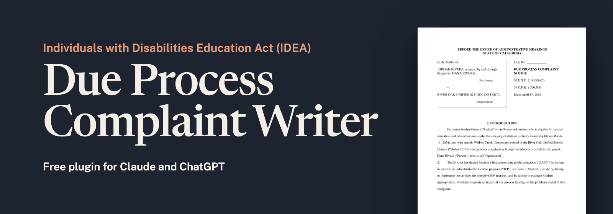</a>
</p>

# Special Education Due Process Complaint Writer

[](LICENSE)
[](https://github.com/b33kman/special-education-due-process-complaint/releases)
[](https://support.claude.com/en/articles/13837440-use-plugins-in-claude)
[](https://developers.openai.com/plugins/build/plugins)

**A free AI plugin for Claude and ChatGPT that writes a special education due process complaint from your child's IEP, school documents and other important information.**

A due process complaint is the written request that starts a hearing when a family and the school disagree about a child's special education under the Individuals with Disabilities Education Act (IDEA). Give the plugin the IEPs, evaluations, prior written notices, progress reports, service logs, emails and any private evaluations. It reads every page, checks the facts with you, lets you choose what to raise, looks up how to file in your state, and gives you the complaint as a **PDF to file** and a **Word file to edit**. It works for all 50 states and the District of Columbia.

It is for parents filing on their own (pro se), advocates, special education attorneys and legal aid organizations. It is not legal advice.

<p align="center">
  <a href="examples/river-oak/complaint.pdf">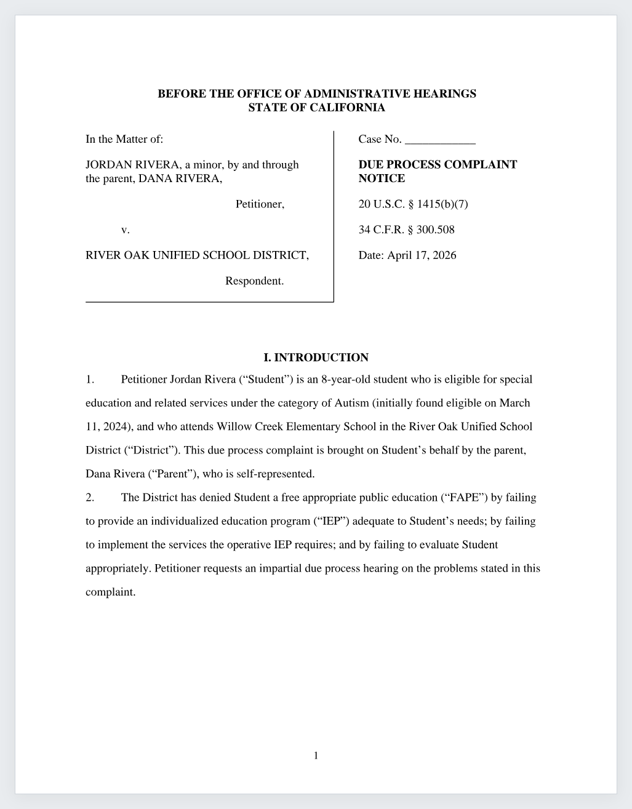</a>
  <br>
  <a href="examples/river-oak/complaint.pdf"><b>See a due process complaint example (PDF)</b></a><br>
  <sub>Made-up people and documents.</sub>
</p>

## What you need

One of these:

- **Claude:** the Claude app on a paid plan (Pro, Max, Team or Enterprise). [Install in Claude](#install-in-claude)
- **ChatGPT:** the ChatGPT desktop app, which allowed plugins on a free account as of September 2026. [Install in ChatGPT](#install-in-chatgpt)

## Install in Claude

You only do this once.

### Step 1. Click **Customize**, then **Plugins**

Open the Claude app. In the left sidebar, click **Customize**. At the top of the page, click **Plugins**.

Check that **Chat** is selected at the top of the sidebar (the speech-bubble icon), not **Code** (`</>`). A plugin added in Code doesn't show up in Chat.

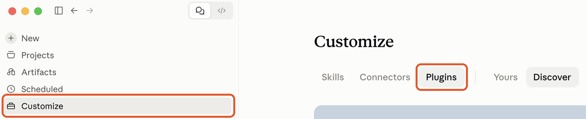

### Step 2. Click **Add**, then **Add marketplace**

The **Add** button is at the top right.

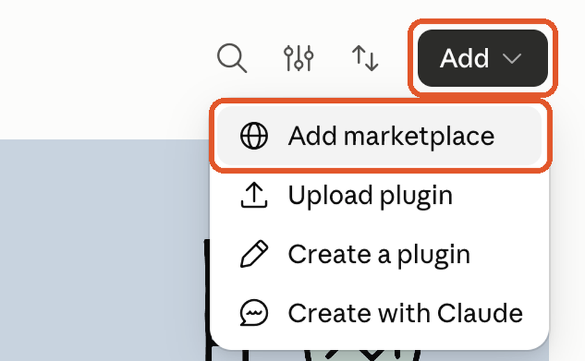

### Step 3. Click **Add from a repository**

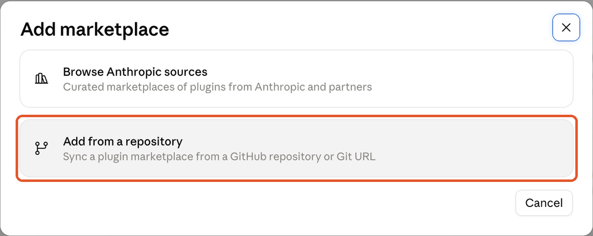

### Step 4. Paste the address, then click **Sync**

Copy this address and paste it into the **URL** box:

```
https://github.com/b33kman/special-education-due-process-complaint
```

Leave **Sync automatically** on, then click **Sync**.

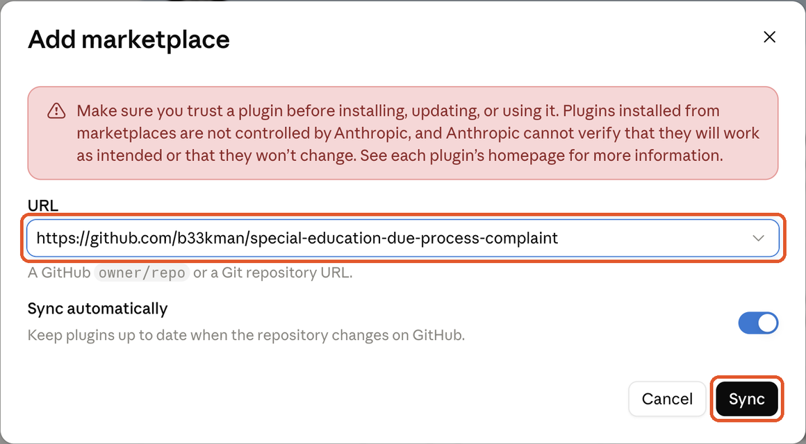

### Step 5. Click **Add** next to **Due Process Complaint Writer**

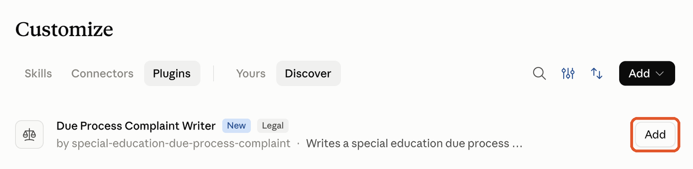

If a yellow message says *"Auto-sync requires the Claude GitHub App to have access to this repository,"* close it. The plugin still installs.

### Step 6. Check that the switch is blue

Click **Due Process Complaint Writer** to open its page. A blue switch at the top right means it's on. You're done.

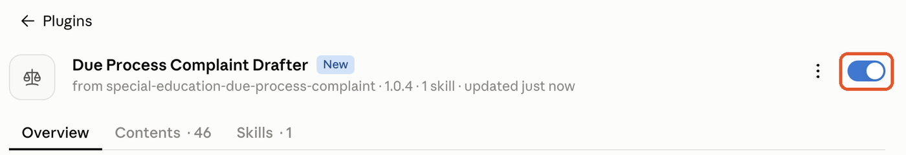

## Install in ChatGPT

In the ChatGPT desktop app. You only do this once.

### Step 1. Open **Plugins** in Settings, then click **Add** and **Add a marketplace**

Open **Settings** and click **Plugins** in the left column. Click **Add** at the top right, then **Add a marketplace**.

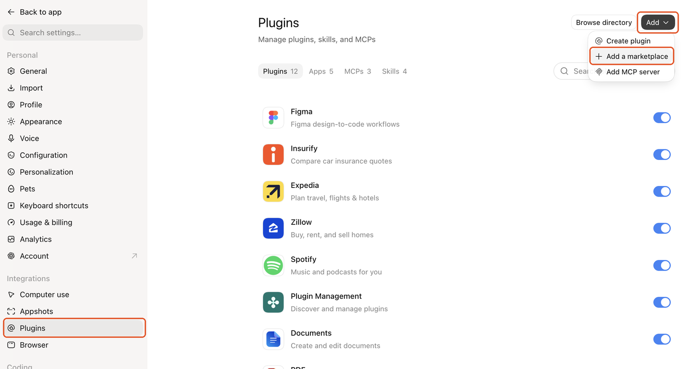

### Step 2. Paste the address, then click **Add marketplace**

Paste this address into the **Source** box. Leave **Git ref** and **Sparse paths** as they are.

```
https://github.com/b33kman/special-education-due-process-complaint
```

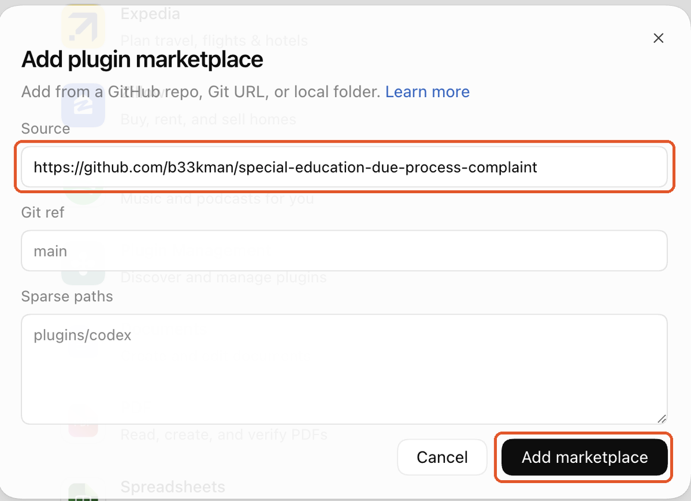

### Step 3. Find the plugin under **Personal**

Click **Plugins** in the left sidebar, then **Personal**. The due process complaint plugin is listed there. Click **⋯** next to it, then **Try now** to start a chat with it.

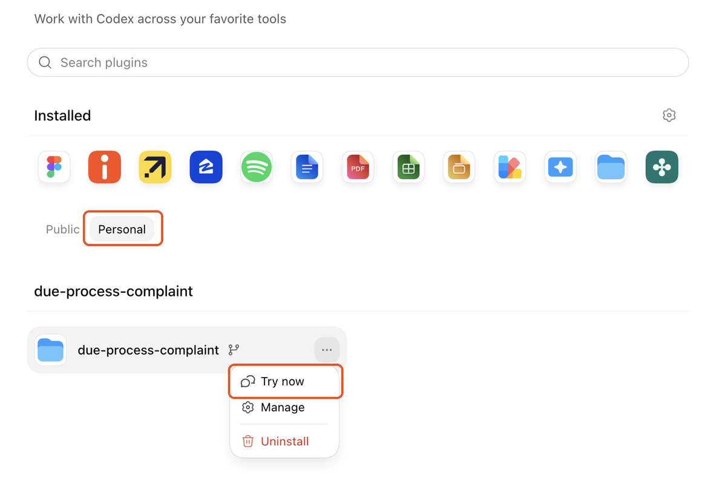

## How to write a due process complaint

1. **Start a new chat with the plugin.** In Claude or ChatGPT, click **New** or **New chat** in the left sidebar.
2. **Attach your documents.** Drag the PDFs into the message box. In Claude, each file can be up to 30 MB.
3. **Say what you want.** For example:

   > Draft a due process complaint from these documents. The state is California and I'm the parent, filing on my own.

4. **Answer the questions.** It shows you the facts it found and the page each came from, and asks you to confirm them. You choose the problems to raise and what you want the school to do. Where the app has no checkboxes, answer with the numbers of the options you want.
5. **Download your files** when it's finished:
   - **complaint.pdf** — the complaint to file
   - **complaint.docx** — the same complaint, to edit in Word
   - **filing-instructions.md** — where and how to file in your state, including which office of your school district gets it and at what address

Until every check passes, the files are named **complaint.DRAFT** and marked **DRAFT — NOT FOR FILING**, so a draft can't be filed by mistake.

For the best results, choose the most capable model the app offers.

## Due process complaint examples

Two finished complaints, written by the plugin from made-up people and documents:

- **[California due process complaint, a parent filing on their own (PDF)](examples/river-oak/complaint.pdf)**
- **[North Carolina due process complaint, an attorney filing (PDF)](examples/pine-hollow/complaint.pdf)**

## How to file a due process complaint in your state

Each state decides which office receives the complaint, how it may be sent, and whether the school district gets it first, at the same time, or as a copy. The school district always gets it. **[STATES.md](STATES.md) lists, for every state and DC, the office that takes special education due process complaints, its official filing page, its contacts, the time limit, and who in the district receives it.** The plugin starts from this table, confirms the details on your state's official filing page every time, and writes the filing instructions for you.

**You won't have to find the school district's address yourself.** The plugin looks up the right office on your district's own website, checks it against the district's letterhead on your documents, and prints it with its address on the complaint's certificate of service.

## If something goes wrong

**In Claude**

- **The plugin shows up in Code but not in Chat.** It was added in Code, which keeps its own list of plugins. Select **Chat** at the top of the sidebar and do the install steps again.
- **You don't see the plugin after Step 4.** Check that the address was pasted exactly, then close and reopen the app.
- **Claude says it can't run code or create files.** Open **Settings → Capabilities** and turn on **Code execution and file creation**, then start a new chat. On a Team or Enterprise plan, ask your administrator.

**In ChatGPT**

- **You don't see the plugin after Step 2.** Check that the address was pasted exactly, then look under **Plugins → Personal** again.
- **ChatGPT says Node.js is missing.** Install it free from [nodejs.org](https://nodejs.org), then ask again.

**Either app**

- **A document is a scan, a photo or an email.** Attach it anyway and say so. It types it out word for word so it can be checked like the rest.
- **Still stuck?** [Tell us what you see](https://github.com/b33kman/special-education-due-process-complaint/issues).

## Updating

**In Claude**, you left **Sync automatically** on in Step 4, which Claude says keeps the plugin up to date when it changes here.

**In ChatGPT**, run the [install steps](#install-in-chatgpt) again to pick up the latest version.

Each new version is listed on the [Releases page](https://github.com/b33kman/special-education-due-process-complaint/releases).

## What it will not do

- Choose the claims or what to ask for. You decide.
- Say whether the complaint will win.
- Fill a gap. If no document and nothing you said supports a fact, the complaint leaves it out.
- Guess a filing address or deadline. It confirms the state's on its official filing page, and the district's on the district's own website, every time.

## Privacy

The documents you attach go to Claude or ChatGPT like any other attachment, under that app's terms. The plugin doesn't send them anywhere else. It looks up your state's filing pages and your school district's website, and those lookups name the district, never the student. If you're an attorney using it on a client's file, make sure the app's terms fit your confidentiality duties.

See the full [Privacy Policy](PRIVACY.md) for the data categories involved, how they are used, who receives them, retention, and your controls.

## Frequently asked questions

### How does it save me time?
It does the slow parts for you. It reads every page of every document, pulls out the dates, figures and quotations that matter, and lays them out as a dated chronology with the page each came from. It suggests the claims your documents support best, finds your state's filing office, address and time limit, and sets the complaint out as a legal pleading, ready as a PDF to file and a Word file to edit. For a folder of seven school documents, the reading, drafting, checking and formatting takes roughly fifteen minutes, plus the time you take answering its questions.

### How is this different from asking a regular AI chat?
A regular chat writes what sounds right. This plugin follows a set procedure built for due process complaints:

- A script checks every date, number and quotation against your documents and refuses anything it can't find there.
- It shows you the facts with the page each came from, and you choose the claims and what to ask for.
- It includes every element federal law requires (34 C.F.R. § 300.508(b)), and a complaint missing one stays a draft.
- It uses your state's filing office, address and time limit, confirmed on the state's official page.
- It produces a formatted pleading (caption, numbered paragraphs, signature block, certificate of service) as a PDF and a Word file, and marks drafts so they can't be filed by mistake.
- It never predicts how your case will turn out.

### Can I use AI to write a due process complaint?
Yes, as long as you check what it writes. A general AI chat can get dates, quotations and legal citations wrong. This plugin is built to catch that, as the next answer explains, but you should still read the complaint before you sign it.

### Will it hallucinate or make things up?
It's built not to, and today's AI models are very capable, but no AI is perfect. The safeguards:

- Every date, number and quotation is checked against your documents, and anything that isn't there is refused.
- It shows you the facts it found, with the page each came from, and asks you to confirm or correct them.
- It reviews the draft for errors a check can't catch, such as a fact that doesn't match its page.
- The files stay marked DRAFT until the check passes.

Always read the whole complaint against your documents before you sign and file it. The person who signs is responsible for it.

### Is my information private and protected?
Your documents go only to Claude or ChatGPT, and Anthropic or OpenAI keeps and protects them under its own privacy and security policies, the same as anything else you share in those apps. The plugin doesn't send your documents anywhere else, and no one who makes the plugin can see them. When it looks up your state's filing rules on the web, those searches don't include your child's name.

Both apps let you choose whether your chats are used to improve their AI: in Claude, in your [privacy settings](https://privacy.claude.com/en/articles/12109829-how-do-i-change-my-model-improvement-privacy-settings); in ChatGPT, under **Settings → Data Controls → Improve the model for everyone**. If you're an attorney using it for a client, make sure the app's terms fit your confidentiality duties.

### Is it legal advice? Will it tell me whether I'll win?
No. It drafts from your documents and the facts you confirm. It suggests the claims your documents support best, but you choose, and it never predicts how the case will turn out. The person who signs the complaint is responsible for it.

### Do I still need a lawyer?
No. A parent can file a due process complaint without a lawyer. A special education attorney or advocate can help you decide what to raise and prepare for the hearing. For free help, your state's Parent Training and Information Center can point you to resources: [find your parent center](https://www.parentcenterhub.org/find-your-center/).

### Can I change the complaint?
Yes. Ask for changes in the chat, and it updates the draft and checks it again. Or edit `complaint.docx` in Word yourself; the plugin's checks don't cover changes you make there, so read them carefully.

### Will it file the complaint for me?
No. It gives you `filing-instructions.md`: where to send the complaint, how it may be sent (mail, email, fax or an online portal, depending on the state), which office of your school district gets it, at what address, and when, and the time limit, each with the official page it came from. You sign and send it. It can also write a short cover letter to go with it.

### What documents should I gather?
Whatever you have: IEPs (current and past), school and private evaluations, prior written notices, progress reports, service logs, report cards, discipline records, letters and emails with the school, and your own notes of meetings and calls. PDFs work best; scans and photos can be read too.

### Who is it for?
Parents filing on their own (pro se), advocates helping families, and special education attorneys and legal aid organizations drafting for clients. It asks a parent in plain words and an attorney in legal terms; the complaint follows the same form either way.

### Is it free?
The plugin is free and open source (MIT license). In Claude you need a paid plan to use plugins: Pro, Max, Team or Enterprise. In ChatGPT, the desktop app allowed plugins on a free account as of September 2026.

### What is a special education due process complaint?
A written complaint that starts a due process hearing under the Individuals with Disabilities Education Act (IDEA). A parent or a public agency may file one on any matter relating to a child's identification, evaluation or educational placement, or the provision of a free appropriate public education (34 C.F.R. § 300.507(a)). A hearing officer decides the dispute after a hearing; the complaint sets out what the hearing is about.

### What must a due process complaint contain?
Under 34 C.F.R. § 300.508(b): the child's name; the address of the child's residence; the name of the child's school; for a homeless child, available contact information and the school; a description of the problem, including the facts relating to it; and a proposed resolution to the extent known. Some states require more. The plugin won't produce a final complaint while one is missing.

### What is a due process complaint notice?
The same document. The IDEA statute calls it a "due process complaint notice" (20 U.S.C. § 1415(b)(7)(A) and (c)(2)); the federal regulations call it a due process complaint (34 C.F.R. § 300.508). Some states call it a request for a due process hearing.

### Is there a due process complaint form?
Every state education agency must publish a model form, but no state or district may require you to use it (34 C.F.R. § 300.509). Any document that contains what § 300.508(b) requires will do. Where a state's form asks for something more, the plugin looks it up and asks you for it.

### How long does a family have to file?
Under 34 C.F.R. § 300.507(a)(2), two years from the date the parent or agency knew or should have known about the action the complaint is about, unless the state has its own time limit. A few do: the table bundled here records one year for Alaska, North Carolina and Wisconsin and three years for Kentucky. The plugin confirms the filing state's time limit on its official filing page every time and points out events older than it; whether an exception applies is for the person signing to decide.

### Where is a due process complaint filed?
It depends on the state. In many it goes to the state education agency; in some to a separate hearings office (California and North Carolina, for example); in others to the school district, with a copy to the state (Illinois and Arizona, for example). The other party always gets a copy (34 C.F.R. § 300.508(a)), and some offices accept a complaint only after the district has been served. **[STATES.md](STATES.md) lists the office, the official filing page, the contacts and the time limit for every state and DC.**

### Can it write a state complaint, an OCR complaint or a 504 grievance?
No. It writes IDEA special education due process complaints only. A state complaint to your state education agency, a complaint to the U.S. Department of Education's Office for Civil Rights, and a Section 504 grievance each follow different rules.

<details>
<summary><b>For developers, Claude Code and Codex</b></summary>

### Install in Claude Code (terminal)

Start `claude`, then type:

```
/plugin marketplace add b33kman/special-education-due-process-complaint
/plugin install due-process-complaint@due-process-complaint
```

Choose **User scope** when asked. Node.js 20 or later must be installed. To update: `/plugin marketplace update due-process-complaint`, or turn on auto-update in `/plugin` → **Marketplaces**.

### Install in Codex (terminal)

```
codex plugin marketplace add b33kman/special-education-due-process-complaint
```

Then open `/plugins` and install it. Node.js 20 or later must be installed.

### Install with the skills CLI (Claude Code, Codex, Cursor and other agents)

```
npx skills add b33kman/special-education-due-process-complaint
```

Node.js 20 or later must be installed first.

### Upload the skill to Claude

Download `due-process-complaint-skill.zip` from the [latest release](https://github.com/b33kman/special-education-due-process-complaint/releases/latest), then in Claude open **Customize → Skills** and upload the ZIP. It won't update by itself. In ChatGPT and Codex, use the marketplace or the skills CLI above.

### As a personal skill, from a clone

```bash
git clone https://github.com/b33kman/special-education-due-process-complaint.git
cd special-education-due-process-complaint
```

Then link it into whichever agent you use:

```bash
ln -s "$(pwd)/skills/due-process-complaint" ~/.claude/skills/due-process-complaint   # Claude
ln -s "$(pwd)/skills/due-process-complaint" ~/.codex/skills/due-process-complaint    # Codex
```

Nothing to install: the three scripts are self-contained and need only Node.js 20 or later. (`npm install` is for running the tests — see below.)

To update: `git pull`. What changed in each version is in [CHANGELOG.md](CHANGELOG.md).

### How it works

The AI reads the PDFs, confirms the facts with the person filing, recommends every claim the record supports by the parts each claim requires (`references/claims.md`) and waits for them to choose the claims and relief, confirms the state's filing details from the bundled table against its official filing page, and drafts `complaint.md`, stating each fact once and pointing each claim to its fact paragraphs by label. `check.mjs` refuses any date, figure or quotation not in the documents or the person's statement, a missing required element, and sections out of order. The draft is then reviewed against `references/review.md`, by a fresh subagent where available. `render.mjs` sets the pleading as PDF and Word, prints each label as its paragraph number, and names the files DRAFT unless the complaint is final and passes the check.

The three scripts are self-contained files built from `src/` with `npm run build`, so they run on Node.js 20 or later with nothing to install, in Claude's and ChatGPT's code environments alike.

Each worked example in [`examples/`](examples/) has its documents, the person's statement, the filing instructions and the finished complaint.

### Testing

```bash
npm install && npm test
```

After editing anything in `src/`, run `npm run build`; a test fails if the scripts in the skill are not the build of `src/`.

Each test breaks a worked example in one way — an invented date, a figure that is only the tail of the real one, a quotation not on the page, a missing school, a section out of order, a label that points nowhere, a claim that only lists paragraph numbers, a paragraph pointer written into a remedy — and asserts the check refuses it, and that a draft is never given the name of the file to file. Others assert what must keep working: that text never runs outside the margins, that the shipped scripts are the build of `src/` unchanged, and that they run with nothing installed.

### Layout

```
.claude-plugin/          Claude plugin and marketplace manifests (ChatGPT and Codex read them too)
.codex-plugin/           OpenAI plugin manifest: the name and description ChatGPT shows
skills/due-process-complaint/
  SKILL.md               the procedure the AI follows
  references/            the exemplar (form and voice), the review checklist, the state table
  scripts/               pdf-text.mjs, check.mjs, render.mjs, built from src/ (do not edit)
src/                     the scripts' source; build.mjs builds them
examples/                two complete worked examples on invented documents
tests/                   the tests
docs/images/             the pictures on this page
CHANGELOG.md             what changed in each version
STATES.md                where to file in each state: office, official page, contacts, time limit
```

**Never commit a real case folder.** The `.gitignore` excludes every `work/` folder and every PDF outside `examples/`.

### Provenance

The exemplar and the state research table are derived from Sped DPC, a due process drafting product built by Beekman One LLC, released here so the procedure can be used and inspected on its own.

</details>

## License

[MIT](LICENSE). The examples are fiction. The state research is a starting point, not legal authority: confirm every detail on the state's official page before relying on it.

## Disclaimer

This software prepares a document from information you supply and confirm. It is not a law firm, does not provide legal advice, and creates no attorney–client relationship. The person who signs and files the complaint is responsible for it.
